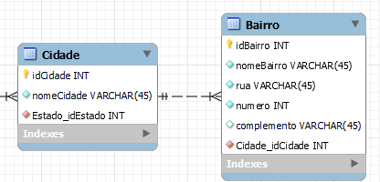
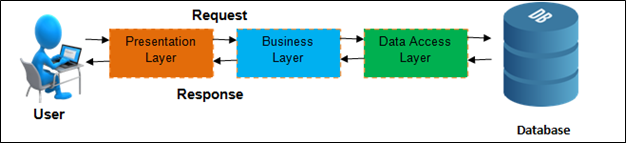
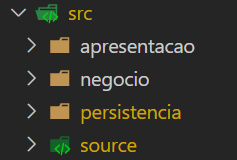

## CRUD | JAVA PROJECT | 01/11/2022

Esse é um projeto que estamos desenvolvendo na [UNIVATES](https://www.univates.br/graduacao/engenharia-de-software) no curso de Engenharia de Software com o [Professor Mouriac](https://www.linkedin.com/in/mouriac-diemer-9a11806/) na diciplina de ***Técnicas e Práticas de Programação***.

Desenvolvedores:
- Luis Ricardo  
- Davi Aguiar  
- João Matuela  

## Features | Implementadas

O projeto basease em um simples sistema de cadastro de itens/pessoas, no estudo de caso atual, utilizaremos uma conexão com base no Postgres futuramente, msa por enquanto estamos utilizando arquivos ***txt***, abaixo o modelo relacional o qual utilizaremos:

As funcionalidades até agora estão na camada de Persistência, são elas:

- `create(Object obj)`: Insere um novo objeto ao arquivo, validando sua *"Primary Key"* evitando duplicidades;
- `read(Integer primaryKey)`: Verifica se o *"ID"* passado como parametro encontra-se nos registros, se sim devolve o objeto por completo;
- `readAll()`: Faz a leitura por completo da base e retorna a mesma para o usuário;
- `readAll(Filter<Object> filterState)`: Faz a leitura de toda a base, utilizando campo que foi instanciado como `Filter` e retorna os registros que se enquadram no filtro;
- `update(Object obj)`: Recebe um objeto com novos valores em seus atributos (menos no *"ID"*) e realiza alterações no registro pré existente na base de dados;
- `delete(Integer primaryKey)`: Realiza a deleção do registro que foi passado como parâmetro;

## Features | Em Desenvolvimento

As funcionalidades que estaremos desenvolvendo a seguir serão nas camadas de:

- `negocio`
- `apresentacao`

## Folder Structure

Esse projeto foi desenvolvido usando como base o seguinte pensamento de arquitetura:

Entretanto utilizamos de primeiro momento uma camada adicional de `source` para melhorarmos algumas questões das dependências do projeto

Nossa arquitetura final ficou no seguinte formato:

